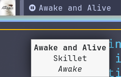

# waybar-mediaplayer

This is a mediaplayer for waybar.



It features:
1. Progress bar
1. Tooltip that displays title, author and album
1. Album cover art (click to zoom)
1. Click to play/pause, scroll up/down to scroll up/down on the playlist

It requires `playerctl` to be installed.

To install:

```
mkdir -p $HOME/.config/waybar/mediaplayer
cp ./src/* $HOME/.config/waybar/mediaplayer
```

Open `$HOME/.config/waybar/mediaplayer/mediaplayer-progressbar-gencss`, and choose your colors for background and overlay (in CSS notation).

Run `$HOME/.config/waybar/mediaplayer/mediaplayer-progressbar-gencss` to generate the necessary CSS files for the progress bar.

Put the following in `$HOME/.config/waybar/config`, substituting `ncspot` with the name of your player (you can find out the name of your player with `playerctl --list-all`):
```
"modules-left": ["custom/mediaplayer"],
```

```
"custom/mediaplayer": {
  "exec": "$HOME/.config/waybar/mediaplayer/mediaplayer --player ncspot",
  "return-type": "json",
  "format": "{}",
  "on-click": "playerctl --player=ncspot play-pause",
  "on-scroll-up": "playerctl --player=ncspot next",
  "on-scroll-down": "playerctl --player=ncspot previous",
  "min-length": 20,
  "max-length": 20
},
```

Put the following in `$HOME/.config/waybar/style.css`:

```
#custom-mediaplayer
{
	font-size: 16px;
  border-radius: 2%;
}
@import "./mediaplayer/mediaplayer-progressbar.css";
```
