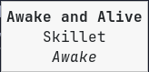
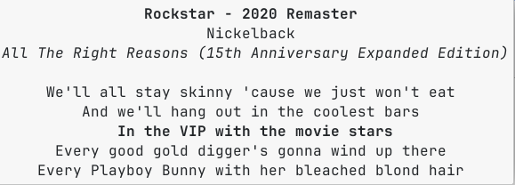

# waybar-mediaplayer

## Retirement notice

I don't use this project anymore and therefore  I'm archiving it.

Feel free to fork it.

## Introduction

This is a mediaplayer for [waybar](https://github.com/Alexays/Waybar).

Widget with album art and progress bar:


Notification with album art, track ticle and track artist


Tooltip with track title, track artist and track album:



Synced lyrics in tooltip:



It features:
1. Progress bar
2. Tooltip that displays title, author and album
3. Synced lyrics in tooltip
4. Album cover art (click to zoom)
5. Optional notification on song change
6. Click to play/pause, scroll up/down to scroll up/down on the playlist

## Requirements

[playerctl](https://github.com/altdesktop/playerctl) must be installed.

The default configuration use Nerd Fonts, so it requires waybar to use a Nerd Font.

The default configuration use [feh](https://github.com/derf/feh) to open the album art image.

## Install

1. Create a virtual environment within which to run waybar. For example, using pyenv this would be:

    ```
    pyenv virtualenv 3.12.0 waybar
    pyenv activate waybar
    ```

1. Create a wrapper script to run waybar inside this virtual environment.

    For example, always using pyenv, create the file `start_waybar` and put it in your PATH:
    ```
    #!/usr/bin/env bash
    . ~/.pyenv/versions/waybar/bin/activate
    waybar
    ```

1. Clone this repo:

    ```
    git clone https://github.com/raffaem/waybar-mediaplayer "$HOME/.config/waybar/waybar-mediaplayer"
    cd "$HOME/.config/waybar/waybar-mediaplayer"
    ```

1. Install the required python packages inside your virtual environment:

    ```
    pip3 install -r requirements.txt
    ```

1. You need to find the name of your player. To do so, run `playerctl --list-all` while your player is running.

1. Open `"$HOME/.config/waybar/waybar-mediaplayer/src/config.json` and change `player_name` with the name of your player.

1. Put the following in `$HOME/.config/waybar/config`:

    ```
    "modules-left": ["image", "custom/mediaplayer"],
    ```

    ```
    "image": {
      "path": "/tmp/waybar-mediaplayer-art",
      "size": 32,
      "signal": 4,
      "on-click": "feh --auto-zoom --borderless --title 'feh-float' /tmp/waybar-mediaplayer-art"
    },

    "custom/mediaplayer": {
        "exec": "$HOME/.config/waybar/waybar-mediaplayer/src/mediaplayer monitor",
        "return-type": "json",
        "format": "{}",
        "on-click": "$HOME/.config/waybar/waybar-mediaplayer/src/mediaplayer play-pause",
        "on-scroll-up": "$HOME/.config/waybar/waybar-mediaplayer/src/mediaplayer next",
        "on-scroll-down": "$HOME/.config/waybar/waybar-mediaplayer/src/mediaplayer previous",
        "min-length": 20,
        "max-length": 20
    },
    ```

    Put the following in `$HOME/.config/waybar/style.css`:

    ```
    #custom-mediaplayer
    {
      font-size: 16px;
      border-radius: 2%;
    }
    @import "./waybar-mediaplayer/src/style.css";
    ```

1. Start waybar using the wrapper script `start_waybar`.

The mediaplayer should work. Click on the progress bar to start/stop playing, and scroll on it to change song.

## Update

```
cd "$HOME/.config/waybar/waybar-mediaplayer"
git pull
```

## Personalization

To disable notifications, put `is_notification=false` in `config.json`.

To change widget's length, set `min-length` and `max-length` in `$HOME/.config/waybar/config`, and set `widget_length` in `$HOME/.config/waybar/waybar-mediaplayer/src/config.json`. These 3 variables MUST be set to the same value.

In order for the album art to automatically update on song change, it's important that the `signal` variable of the `image` module in `$HOME/.config/waybar/config` matches the `image_signal` variable in `$HOME/.config/waybar/waybar-mediaplayer/src/config.json`.

If you change the colors of the bar in `$HOME/.config/waybar/waybar-mediaplayer/src/config.json`, make sure to apply the changes by running `$HOME/.config/waybar/waybar-mediaplayer/src/mkstyle` and restart waybar.

## Troubleshooting

### Firefox users

Although Firefox reports MPRIS metadata, the metadata it reports is not sufficient, as it doesn't report song's length. Please install the [Plasma Integration](https://addons.mozilla.org/en-US/firefox/addon/plasma-integration) add-on and use `plasma-browser-integration` as `player_name` in `$HOME/.config/waybar/waybar-mediaplayer/src/config.json`.

To have album art, make sure to set `convert_to_jpeg` to `true` in `$HOME/.config/waybar/waybar-mediaplayer/src/config.json` (this option decreases performance, don't use it if not necessary).

### Me progress bar doesn't work

It's likely cause by the player not reporting song length or position back to us. Run `$HOME/.config/waybar/waybar-mediaplayer/src/mediaplayer -vvv` to debug.

### Player reports its name with instance number

If the player reports an instance after its name, please provide only the player name without the instance number. For example, [kew](https://github.com/ravachol/kew) may report itself as `kew123456`, where `123456` is an instance number which will change with different runs of `kew`. In this case, we report only `kew` without the instance number. This software will check whether the reported player name _starts_ with the name you provide to bind the correct player.

### Me title and tooltip are empty

It's likely your song file doesn't contain metadata.

Run `exiftool SONG.mp3` and check the `Title`, `Album` and `Artist` fields.

### Me album art doesn't change on song change

Make sure that the `signal` in the `image` module in `$HOME/.config/waybar/config` matches the number provided by `image_signal` in `$HOME/.config/waybar/waybar-mediaplayer/src/config.json`.

